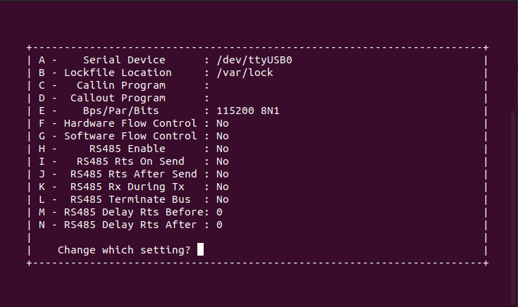

# Instalação e Utilização

Esta seção visa abordar a variabilidade de hardware, a partir da execução e armazenamento dos tempos de execução do benchmark em um ambiente bare-metal, utilizando o BeagleBone Black (BBB).
  
## Instalação do UBoot

A fim de carregar programas bare-metal na memória do BBB foi utilizado o UBoot, um bootloader de primeiro e segundo estágio, capaz de realizar a inicialização do hardware, o carregamento do programa e a passagem de controle para o binário. Para isso, é necessário, primeiro, carregar uma versão do UBoot construída visando o BBB, tal versão pode ser obtida realizando o build do próprio source e especificando o hardware alvo ou pegando uma imagem do UBoot pré-built para o hardware alvo.

Por motivos de simplicidade, utilizaremos uma versão já construída, disponibilizada no repositório, na pasta UBoot.

Com os arquivos UBoot.img e MLO baixados, é necessário carregá-los no cartão microSD que será utilizado para o carregamento do Uboot no BBB. Para isso, é de suma importancia que sejam criadas duas partições no microSD:

```
#BOOT --> Partição responsável por armazenar os arquivos do UBoot (MLO e UBoot.img);
  #Label: BOOT
  #Formato: FAT32
  #Tamanho: Necessario para armazenamento dos arquivos - No cenário trabalhado a partição foi criada com 1GB.
  #Flags: boot
```

```
#ROOTFS --> Partição para os demais arquivos.;
  #Label: ROOTFS
  #Formato: EXT4
  #Tamanho: Resto do espaço disponível.
  #Flags: Sem flags.
```
As partições podem ser facilmente criadas e configuradas utilizando a ferramenta GPARTED.

Com as partições criadas e os arquivos do UBoot armazenados na partição BOOT, o usuário já deve ser capaz de acessar o console do UBoot, no BBB, via conexão serial. A fim de estabelecer a conexão serial e testar o funcionamento do bootloader é necessário um emulador de terminal como putty, minicom, etc. No cenário em questão, utilizou-se o minicom.

## Instalação e Configuração do Minicom

Nessa etapa, abordaremos brevemente a instalação e configuração do minicom

Para instalar o minicom devemos executar:
~~~
sudo apt-get install minicom
~~~

Em seguida, é necessario realizar a configuracao do minicom, para entrarmos no menu de configuracao devemos executar:
~~~
sudo minicom -s
~~~

Agora basta acessarmos a opção _Serial port setup_ e configurarmos seguindo a imagem abaixo:



Com o minicom configurado, basta acessarmos seu terminal com o comando
~~~
sudo minicom
~~~

**Imagem do minicom escutando a serial**

**\*OBS**: Caso o cabo USB Serial não esteja sendo reconhecido pela máquina, o resultado da imagem acima não será alcançado.


## Acessando o terminal do UBoot no BBB

Com o UBoot já no microSD e o minicom corretamente configurado, precisamos conectar o BBB na serial, para isso será necessário um cabo conversor USB TTL, como visto na imagem abaixo:

**Imagem Cabo Conversor USB TTL**

Agora devemos conectar o cabo no BBB seguindo a seguinte configuração:

**Imagem da conexao do cabo no BBB**

Com o cabo corretamente conectado, basta energizarmos o BBB com o botão de boot pressionado, fazendo com que o boot seja realizado pelo microSD. Por fim, basta pressionarmos qualquer tecla para que o processo de boot padrão seja cancelado e o terminal do UBoot liberado.

**Imagem do terminal do UBoot**

## Configurando Ambiente para Build Bare-Metal

O AM3358x possui uma arquitetura relativamente complexa, o que dificulta a configuração de todo o hardware. Visando possibilitar a utilização bare-metal a Texas Instruments criou o StarterWare, que disponibiliza uma abstração do hardware do dispositivo, inicializando certos componentes e disponibilizando APIs uteis. Em nosso cenário as APIs disponibilizadas não serão utilizadas, mas reutilizaremos a estrutura do projeto para realizar o *build* de nossos benchmarks, uma vez que o arquivo .lds e init.S do projeto StarterWare serão uteis para configurarmos alguns aspectos do hardware. 

Nessa seção abordaremos como configurar o ambiente, utilizando como referência a documentação disponibilizada pela [octavosystems](https://octavosystems.com/app_notes/bare-metal-on-osd335x-using-u-boot/).

**Obs:** As etapas abaixo foram realizadas em uma máquina com Ubuntu 22.04.2 LTS.

A configuração do ambiente e dividida em x macros etapas, sendo elas:
1. Instalação do StarterWare para o AM335x
2. Instalação do compilador Linaro GCC
3. Build do StarterWare

### Instalação do StarterWare para o AM335x

Inicialmente e necessário baixarmos o StarterWare para o processador AM335x e o patch para o BeagleBone, que pode, ser obtidos [aqui](http://www.ti.com/tool/starterware-sitara)

Com os arquivos baixados:

1. Abrir terminal;
2. Criar um repositório para armazenamento dos arquivos;
~~~
mkdir ~/bareMetal
~~~

3. Mover o instalador do StarterWare para o diretório criado
~~~
mv ~/Downloads/AM335x_Starterware_02_00_01_01_Setup.bin ~/bareMetal
~~~

4. Possibilitar a execução do instalador
~~~	
cd ~/bareMetal
chmod +x AM335X_StarterWare_02_00_01_01_Setup.bin
~~~

5. Instalar dependências do StarterWare
~~~
sudo apt-get update
sudo apt-get install zlib1g-dev libncurses5-dev
~~~

6. Executar o instalador
~~~
./AM335X_StarterWare_02_00_01_01_Setup.bin
~~~
7. Durante a instalação é necessário mudar o caminho de instalação para ~/bareMetal/AM335X_StarterWare_02_00_01_01 e o tipo de instalação para *Typical*.
8. Instalar o patch para o BeagleBone Black
~~~
mv ~/Downloads/StarterWare_BBB_support.tar.gz ~/bareMetal/AM335X_StarterWare_02_00_01_01
cd ~/bareMetal/AM335X_StarterWare_02_00_01_01
tar xvfz StarterWare_BBB_support.tar.gz
~~~

### Instalação do compilador Linaro GCC

Agora vamos instalar o cross-compiler para podermos compilar nossos benchmarks visando o processador AM335x.

No trabalho foi utilizado a *toolchain* arm-none-eabi, a versão utilizada pode ser obtida [aqui](https://launchpad.net/gcc-arm-embedded/4.7/4.7-2012-q4-major).

Com o *cross-compiler* baixado:

1. Criar uma pasta para o compilador e mover o arquivo baixado
~~~
mkdir ~/bareMetal/linaro-gcc
mv ~/Downloads/gcc-arm-none-eabi-4_7-2012q4-20121208-linux.tar.bz2 ~/bareMetal/linaro-gcc
~~~

2. Extrair o compilador
~~~
cd ~/bareMetal/linaro-gcc
tar xvfj gcc-arm-none-eabi-4_7-2012q4-20121208-linux.tar.bz2
~~~

3. Adicionar o caminho do compilador no makefile do StarterWare
~~~
gedit ~/bareMetal/AM335X_StarterWare_02_00_01_01/build/armv7a/gcc/makedefs
~~~

4. Modificar a variável "PREFIX" no arquivo aberto no passo 3
~~~
ifndef PREFIX
PREFIX=${LIB_PATH}/bin/arm-none-eabi-
endif
~~~

5. Criar variável de ambiente para o compilador
~~~
export LIB_PATH=${HOME}/bareMetal/linaro-gcc/gcc-arm-none-eabi-4_7-2012q4
~~~

### Build do StarterWare

Antes de realizarmos a build precisamos, primeiramente, alterar o arquivo init.S, isso se deve ao fato de em nosso processo propormos a desativação da cache L2.

1. Abrir o arquivo Init.S
~~~
gedit ~/bareMetal/AM335X_StarterWare_02_00_01_01/system_config/armv7a/gcc/init.S
~~~

2. Adicionar o bloco de código depois de "Entry:", este bloco será executado antes do main() presente no source.

O código abaixo foi concebido com base nas etapas para [desativação da cache L2](https://developer.arm.com/documentation/ddi0344/k/level-2-memory-system/enabling-and-disabling-the-l2-cache-controller) disponibilizada na documentação do ARM Cortex-a8, assim como na documentação de cada um dos registradores, citados no processo de desativação, [Control Register](https://developer.arm.com/documentation/ddi0344/k/system-control-coprocessor/system-control-coprocessor-registers/c1--control-register) e [Auxiliary Control Register](https://developer.arm.com/documentation/ddi0344/k/system-control-coprocessor/system-control-coprocessor-registers/c1--auxiliary-control-register)

~~~
	SUB r0, r0, r0
	MCR   p15, 0, r0, c1, c0, 0  @ Disable MMU, Data Cache, Instruction Cache and Error Handlings
	
	@===========================================
	SUB r4, r4, r4
	MRC p15, 0, r4, c1, c0, 1
  	BIC r4, r4, #(1 << 1)     @ Disable L2EN (bit 1)
  	MCR p15, 0, r4, c1, c0, 1
  	@===========================================
    	
	@ =========================================
	MRC p15, 0, r0, c1, c0, 0
	
	ORR r0, r0, #(1 << 0)    @ Enable MMU
	ORR r0, r0, #(1 << 2)     @ Enable C bit (bit 2)
	ORR r0, r0, #(1 << 12)     @ Enable I bit (bit 12)
	
	MCR   p15, 0, r0, c1, c0, 0
	@ =========================================
~~~

3. Salve e feche o arquivo
4. Realizar o Build dos exemplos
~~~
cd ~/bareMetal/AM335X_StarterWare_02_00_01_01/build/armv7a/gcc/am335x/beaglebone
make
~~~

5. Acessar o binário gerado
~~~
cd ~/bareMetal/AM335X_StarterWare_02_00_01_01/binary/armv7a/gcc/am335x/beaglebone/NomeDoExemplo/Release
~~~

### Build dos Benchmarks

Até agora vimos como configurar o ambiente e buildar os exemplos básicos já presentes no projeto StarterWare. Nesta seção, trataremos de como realizar o build de nossos próprios códigos, utilizando a estrutura já disponibilizada pelo StarterWare.

1. Acessar a pasta de exemplos, onde o código, alvo do build, deverá ser colocado
~~~
cd ~/bareMetal/AM335X_StarterWare_02_00_01_01/examples/
~~~

2. Criar uma pasta para o código alvo
~~~
mkdir <NomeDoExemplo>
~~~
3. Colocar o arquivo <NomeDoExemplo>.c dentro da pasta criada
4. Criar o arquivo link e o arquivo makefile
~~~
cd ~bareMetal/AM335X_StarterWare_02_00_01_01/build/armv7a/gcc/am335x/beaglebone
mkdir <NomeDoExemplo>
cd <NomeDoExemplo>
~~~

5. Com a pasta criada, devemos criar 2 arquivos dentro dela, o arquivo de link do source e o arquivo de makefile. Aqui reutilizaremos o .lds dos outros exemplos, disponibilizado pelo projeto StarterWare para o AM335x, que será o mesmo para todos os códigos.

\<NomeDoExemplo\>.lds :

~~~
/*
* Copyright (C) 2010 Texas Instruments Incorporated - http://www.ti.com/ 
*/
/* 
*  Redistribution and use in source and binary forms, with or without 
*  modification, are permitted provided that the following conditions 
*  are met:
*
*    Redistributions of source code must retain the above copyright 
*    notice, this list of conditions and the following disclaimer.
*
*    Redistributions in binary form must reproduce the above copyright
*    notice, this list of conditions and the following disclaimer in the 
*    documentation and/or other materials provided with the   
*    distribution.
*
*    Neither the name of Texas Instruments Incorporated nor the names of
*    its contributors may be used to endorse or promote products derived
*    from this software without specific prior written permission.
*
*  THIS SOFTWARE IS PROVIDED BY THE COPYRIGHT HOLDERS AND CONTRIBUTORS 
*  "AS IS" AND ANY EXPRESS OR IMPLIED WARRANTIES, INCLUDING, BUT NOT 
*  LIMITED TO, THE IMPLIED WARRANTIES OF MERCHANTABILITY AND FITNESS FOR
*  A PARTICULAR PURPOSE ARE DISCLAIMED. IN NO EVENT SHALL THE COPYRIGHT 
*  OWNER OR CONTRIBUTORS BE LIABLE FOR ANY DIRECT, INDIRECT, INCIDENTAL, 
*  SPECIAL, EXEMPLARY, OR CONSEQUENTIAL DAMAGES (INCLUDING, BUT NOT 
*  LIMITED TO, PROCUREMENT OF SUBSTITUTE GOODS OR SERVICES; LOSS OF USE,
*  DATA, OR PROFITS; OR BUSINESS INTERRUPTION) HOWEVER CAUSED AND ON ANY
*  THEORY OF LIABILITY, WHETHER IN CONTRACT, STRICT LIABILITY, OR TORT 
*  (INCLUDING NEGLIGENCE OR OTHERWISE) ARISING IN ANY WAY OUT OF THE USE 
*  OF THIS SOFTWARE, EVEN IF ADVISED OF THE POSSIBILITY OF SUCH DAMAGE.
*
*/

/* ld script for StarterWare AM335x */

/*
** The stack is kept at end of the image, and its size is 128 MB.
** The heap section is placed above the stack to support I/O
** operations using semihosting. The size of the section is 2KB.
*/

MEMORY
{
    DDR0 :   o = 0x80000000,  l = 0x10000000  /* 256MB external DDR Bank 0 */
}

OUTPUT_FORMAT("elf32-littlearm", "elf32-littlearm", "elf32-littlearm")
OUTPUT_ARCH(arm)

SECTIONS
{

        .startcode :
        {
            . = ALIGN(4);
            *init.o      (.text)
        } >DDR0

        .text :
        {
            . = ALIGN(4);
            *(.text*)
            *(.rodata*)
        } >DDR0

        .data :
        {
            . = ALIGN(4);
            *(.data*)
        } >DDR0

        .bss :
        {
            . = ALIGN(4);
            _bss_start = .;
            *(.bss*)
            *(COMMON)
            _bss_end = .;
        } >DDR0

        .heap :
        {
            . = ALIGN(4);
            __end__ = .;
            end = __end__;
            __HeapBase = __end__;
            *(.heap*)
            . = . + 0x800;
            __HeapLimit = .;
        } >DDR0

        .stack :
        {
            . = ALIGN(4);
            __StackLimit = . ;
            *(.stack*)
            . = . + 0x7FFFFF8;
            __StackTop = .;
        } >DDR0
        _stack = __StackTop;

}

~~~

Criar e alterar o arquivo makefile substituindo \<omeDoExemplo\> pelo escolhido.

makefile :
~~~
#
# Copyright (C) 2010 Texas Instruments Incorporated - http://www.ti.com/ 
#
# 
#  Redistribution and use in source and binary forms, with or without 
#  modification, are permitted provided that the following conditions 
#  are met:
#
#    Redistributions of source code must retain the above copyright 
#    notice, this list of conditions and the following disclaimer.
#
#    Redistributions in binary form must reproduce the above copyright
#    notice, this list of conditions and the following disclaimer in the 
#    documentation and/or other materials provided with the   
#    distribution.
#
#    Neither the name of Texas Instruments Incorporated nor the names of
#    its contributors may be used to endorse or promote products derived
#    from this software without specific prior written permission.
#
#  THIS SOFTWARE IS PROVIDED BY THE COPYRIGHT HOLDERS AND CONTRIBUTORS 
#  "AS IS" AND ANY EXPRESS OR IMPLIED WARRANTIES, INCLUDING, BUT NOT 
#  LIMITED TO, THE IMPLIED WARRANTIES OF MERCHANTABILITY AND FITNESS FOR
#  A PARTICULAR PURPOSE ARE DISCLAIMED. IN NO EVENT SHALL THE COPYRIGHT 
#  OWNER OR CONTRIBUTORS BE LIABLE FOR ANY DIRECT, INDIRECT, INCIDENTAL, 
#  SPECIAL, EXEMPLARY, OR CONSEQUENTIAL DAMAGES (INCLUDING, BUT NOT 
#  LIMITED TO, PROCUREMENT OF SUBSTITUTE GOODS OR SERVICES; LOSS OF USE,
#  DATA, OR PROFITS; OR BUSINESS INTERRUPTION) HOWEVER CAUSED AND ON ANY
#  THEORY OF LIABILITY, WHETHER IN CONTRACT, STRICT LIABILITY, OR TORT 
#  (INCLUDING NEGLIGENCE OR OTHERWISE) ARISING IN ANY WAY OUT OF THE USE 
#  OF THIS SOFTWARE, EVEN IF ADVISED OF THE POSSIBILITY OF SUCH DAMAGE.
#
#
#******************************************************************************

#
# Locating the root directory
#
ROOT=../../../../../../

#
# Device and EVM definitions
#
DEVICE=am335x
EVM=beaglebone

#
# Include the makefile definitions. This contains compiler, linker and
# archiver definitions and options
#
include ${ROOT}/build/armv7a/gcc/makedefs

#
# Target Directories that need to be built
#
DIRS=${DRIVERS_BLD} ${PLATFORM_BLD} ${SYSCONFIG_BLD} ${UTILITY_BLD}

#
# The application directory and name
#
APPDIR=<NomeDoExemplo>
APPNAME=<NomeDoExemplo>

#
# Where the application will be loaded to. This is required to generate
# image with Header (Load Address and Size)
#
IMG_LOAD_ADDR = 0x80000000

#
# Application Location
#
APP=${ROOT}examples/${EVM}/$(APPDIR)/
APP_BIN=${ROOT}/binary/${TARGET}/${COMPILER}/${DEVICE}/${EVM}/$(APPDIR)

#
# Application source files
#
APP_SRC=$(APP)/*.c

#
# Required library files
#
APP_LIB=-ldrivers  \
	-lutils    \
	-lplatform \
	-lsystem_config

#
# Rules for building the application and library
#
all: debug release

debug:
	make TARGET_MODE=debug lib
	make TARGET_MODE=Debug bin

release:
	make TARGET_MODE=release lib
	make TARGET_MODE=Release bin

lib:
	@for i in ${DIRS};				\
	do						\
		if [ -f $${i}/makefile ] ;		    \
		then					  \
			make $(TARGET_MODE) -C $${i} || exit $$?; \
		fi;					   \
	done;


bin:
	$(CC)  $(CFLAGS) $(APP_SRC)
	@mkdir -p $(TARGET_MODE)/
	@mv *.o* $(TARGET_MODE)/
	$(LD) ${LDFLAGS} ${LPATH} -o $(TARGET_MODE)/$(APPNAME).out \
          -Map $(TARGET_MODE)/$(APPNAME).map $(TARGET_MODE)/*.o* \
          $(APP_LIB) -lc -lgcc $(APP_LIB) $(RUNTIMELIB) -T $(APPNAME).lds
	@mkdir -p $(APP_BIN)/$(TARGET_MODE)
	@cp $(TARGET_MODE)/$(APPNAME).out $(APP_BIN)/$(TARGET_MODE)/$(APPNAME).out
	$(BIN) $(BINFLAGS) $(APP_BIN)/$(TARGET_MODE)/$(APPNAME).out \
               $(APP_BIN)/$(TARGET_MODE)/$(APPNAME).bin 
	cd $(ROOT)/tools/ti_image/; gcc tiimage.c -o a.out; cd - 
	       $(ROOT)/tools/ti_image/a.out $(IMG_LOAD_ADDR) NONE \
               $(APP_BIN)/$(TARGET_MODE)/$(APPNAME).bin \
               $(APP_BIN)/$(TARGET_MODE)/$(APPNAME)_ti.bin; rm -rf $(ROOT)/tools/ti_image/a.out;


#
# Rules for cleaning
#
clean:
	@rm -rf Debug Release $(APP_BIN)/Debug $(APP_BIN)/Release

clean+: clean
	@make TARGET_MODE=clean lib


~~~

6. Adicionar novo diretório criado no arquivo makefile para que o build seja realizado.

~~~
gedit ~bareMetal/AM335X_StarterWare_02_00_01_01/build/armv7a/gcc/am335x/beaglebone/makefile
~~~

7. Com o makefile aberto adicionar o novo diretorio na seção DIRS e salvar
~~~
DIRS=platform \
	.
	.
	.
    <NomeDoExemplo> \
	.
	.
	.
     binary_search \
~~~

8. Agora basta realizar o build novamente do projeto e, caso não haja erros de sintaxe, o arquivo .bin será gerado na pasta de binarios vista anteriormente.

~~~
cd ~/bareMetal/AM335X_StarterWare_02_00_01_01/build/armv7a/gcc/am335x/beaglebone
make clean
make
~~~

# Instrumentação em hardware

Agora que temos o ambiente configurado e sabemos como gerar o binário para um código customizado, para a execução no BBB, podemos instrumentar o código para a medição ponta a ponta no hardware. Essa seção tratará da instrumentação colocada no código fonte.

A fase de instrumentação define 4 funções principais as quais os cabeçalhos podem ser vistos abaixo. A seguir trataremos de cada uma separadamente.

~~~
//=========================== Instrumentation Definitions =========================== 

typedef signed int int32_t;

void cache_maintenance();

void init_cache_garbage_array();

static inline unsigned int get_cyclecount (void);

static inline void init_perfcounters (int32_t do_reset, int32_t enable_divider);

//=========================== Instrumentation Definitions =========================== 
~~~

## Configuração e leitura do contador de ciclos

### static inline void init_perfcounters (int32_t do_reset, int32_t enable_divider)


O acesso ao registrador de ciclos de clock depende do atual nível de acesso do processador, no nosso caso estamos com o nível 1111 que equivale ao nível privilegiado e seguro, o AM335x não permite que alteremos todos os registradores, haja visto que alguns deles necessitam que você, além disso, esteja em uma TrustZone, o que só é alcançado pela fabricante.

Porém tal nível é suficiente para que possamos acessar os registradores necessários para a instrumentação. A primeira etapa realizada é ativar todos os contadores, assim como ativar a exportação de eventos do barramento de eventos para blocos de monitoramento externo. O ARM Cortex-A8 possui um registrador responsável pelo [monitoramento de performance (c9)](https://developer.arm.com/documentation/ddi0344/k/system-control-coprocessor/system-control-coprocessor-registers/c9--performance-monitor-control-register), o qual iremos alterá-lo. O código utilizado, pode ser visto abaixo e foi reutilizado do [link](https://stackoverflow.com/questions/34081183/compute-clock-cycle-count-on-arm-cortex-a8-beaglebone-black):

~~~
static inline void init_perfcounters (int32_t do_reset, int32_t enable_divider){
  // in general enable all counters (including cycle counter)
  int32_t value = 1;

  // peform reset:  
  if (do_reset)
  {
    value |= 2;     // resetar todos os contadores para zero.
    value |= 4;     // resetar contadores de ciclo para zero.
  } 

  if (enable_divider)
    value |= 8;     // enable "by 64" divider for CCNT.

  value |= 16;

  // program the performance-counter control-register:
  asm volatile ("MCR p15, 0, %0, c9, c12, 0\t\n" :: "r"(value));  

  // enable all counters:  
  asm volatile ("MCR p15, 0, %0, c9, c12, 1\t\n" :: "r"(0x8000000f));  

  // clear overflows:
  asm volatile ("MCR p15, 0, %0, c9, c12, 3\t\n" :: "r"(0x8000000f));
}
~~~

No cenário estudado, o clock foi configurado com o divisor desligado, portanto o valor escrito no monitor de performance(c9), mais especificamente na linha abaixo, é 17:
~~~
asm volatile ("MCR p15, 0, %0, c9, c12, 0\t\n" :: "r"(value));
~~~

O que equivale a 10001. Olhando na [documentação do registrador](https://developer.arm.com/documentation/ddi0344/k/system-control-coprocessor/system-control-coprocessor-registers/c9--performance-monitor-control-register) temos que, da direita para a esquerda, o bit na posição 0 representa a ativação de todos os contadores e o bit 5 representa a habilitação da exportação dos eventos dos barramentos para um bloco monitor externo.

A linha seguinte equivale a escrita no registrador de [habilitação do conjunto de contadores(c9)](https://developer.arm.com/documentation/ddi0344/k/system-control-coprocessor/system-control-coprocessor-registers/c9--count-enable-set-register). Mais especificamente, ele habilita os 4 contadores, representados pelos bits 0, 1, 2 e 3, e habilita o contador de ciclos, representado pelo bit 31.
~~~
  asm volatile ("MCR p15, 0, %0, c9, c12, 1\t\n" :: "r"(0x8000000f));  
~~~

Por fim, a linha abaixo desabilita o overflow dos contadores habilitados, através da escrita no registrador [Overflow Flag Status (c9)](https://developer.arm.com/documentation/ddi0344/k/system-control-coprocessor/system-control-coprocessor-registers/c9--overflow-flag-status-register).
~~~
asm volatile ("MCR p15, 0, %0, c9, c12, 3\t\n" :: "r"(0x8000000f));
~~~

Com isso, temos nosso contador de ciclos habilitado.

### static inline unsigned int get_cyclecount (void);

A função get_cyclecount é a responsável por retornar o valor de ciclos decorridos.

~~~
static inline unsigned int get_cyclecount (void){
  unsigned int value;
  // Read CCNT Register
  asm volatile ("MRC p15, 0, %0, c9, c13, 0\t\n": "=r"(value));
  return value;
}
~~~

De maneira geral, é uma função bem simples, em que seu único objetivo é ler o [Cycle Count Register (c9)](https://developer.arm.com/documentation/ddi0344/k/system-control-coprocessor/system-control-coprocessor-registers/c9--cycle-count-register?lang=en) e armazenar seu valor na variavel *value* para que possa ser retornado ao ponto de chamada.

## Análise e manutenção da cache

Com as duas funções comentadas anteriormente já somos capazes de contabilizar a quantidade de ciclos decorridos entre dois pontos, porém é necessário lembrarmos que o hardware estudado possui, ativa, uma cache L1 de 32KB, portanto caso apenas contabilizemos o número de ciclos decorridos entre cada execução notaremos que o valor resultante sofrerá uma diminuição até se estabilizar. Isto ocorre pois a cada execução estamos preenchendo a cache com instruções e dados que serão úteis para o fluxo estudado, o que consequentemente o deixará mais performático.

Tendo em vista que o objetivo é encontrarmos o pior tempo de execução do fluxo estudado, cada execução deve ser realizada nas piores condições do hardware, isto é, no pior cenário da cache para nosso programa alvo. Como comentado no artigo, o pior cenário da cache depende da política de substituição implementada pela mesma, em nosso caso a cache implementa a política *write-back* o que faz com que o pior cenário para a cache seja ela completamente preenchida com dados que não serão úteis para nosso programa estudado.

### void init_cache_garbage_array() e void cache_maintenance();

A função init_cache_garbage_array é responsável por sujar a cache L1 antes da primeira iteração do programa analisado, e pode ser vista no snippet abaixo.

~~~
void init_cache_garbage_array(){

	asm volatile("MCR p15, 0, %0, c7, c5, 0" :: "r"(0));//invalida conteudo da cache de instrucoes, etapa encontrada na documentacao do cortex-a8 no site do arm

	int* garbage_array_addr = (int*)0x8009b000; //posicao de inicio do array;
	int i;
	for(i = 0; i < 8192; i++){
		*(garbage_array_addr+(i*4)) = 0; //preenchemos 1 a cada 4 endereços
		
	}

}
~~~

Vamos análisar seu funcionamento, inicialmente executamos a linha:

~~~
asm volatile("MCR p15, 0, %0, c7, c5, 0" :: "r"(0));
~~~

Essa linha corresponde a [invalidacao da cache de instrucoes](https://developer.arm.com/documentation/ddi0344/k/system-control-coprocessor/system-control-coprocessor-registers/c7--cache-operations?lang=en). Com a cache de instrucoes invalidada escolhemos um endereco de memoria livre para que as operacoes de substituicao de dados,da cache de dados, se iniciem. Em nosso caso o endereco escolhido foi 0x8009b000, o que da bastante espaco do endereco 0x80000000 para que os benchmarks avaliados sejam carregados e executados sem problemas.

Em seguida realizamos o acesso e a escrita do valor 0 em 8192 enderecos, pulando 4 enderecos entre cada acesso.

~~~
	int* garbage_array_addr = (int*)0x8009b000; //posicao de inicio do array;
	int i;
	for(i = 0; i < 8192; i++){
		*(garbage_array_addr+(i*4)) = 0; //preenchemos 1 a cada 4 endereços
		
	}
~~~

A rotina de manutenção da cache tem uma grande dependência de sua modelagem, isto é, de seu tamanho total, da quantidade de índices, do número de linhas, do tamanho das linhas e da política de substituição. No cenário estudado, a cache possui um total de 518 linhas, cada uma com um tamanho de 64 bytes. Por ser uma cache 4-way associative, cada índice irá agrupar 4 linhas, o que resultará em uma cache com 128 índices únicos. Levando em consideração que uma word possui 4 bytes, cada linha na cache será capaz de armazenar 16 words, logo a rotina de manutenção da cache deve ser capaz de acessar endereços de memória suficientes, pertencentes a diferentes blocos, de forma que todos os índices da cache sejam visitados.

Assim sendo, o número de iterações(8192) foi escolhido tendo como base o número de acessos a cada índice único que o mesmo proporciona. Uma vez que cada linha armazena 16 words, cada bloco carregado da memória principal será composto por 16 endereços, haja visto que cada endereço é capaz de armazenar 4 bytes(1 word), logo se estamos pulando de 4 em 4 endereços isso faz com que 1 a cada 4 endereços acessados resulte em um miss na cache, o que consequentemente faz com que seu bloco seja carregado na cache. Logo, das 8192 iterações, 2048 resultam em um miss, além disso isso faz com que cada índice único seja acessado um número total de 16 vezes.


A funcao cache_maintenance() funciona da mesma forma, e pode ser vista abaixo:

~~~
void cache_maintenance(){
	
	asm volatile("MCR p15, 0, %0, c7, c5, 0" :: "r"(0));
	
	int* garbage_array_addr = (int*)0x8009b000;
	int i;
	for(i = 0; i < 8192; i++){
		//*(garbage_array_addr+(i*4)) = *(garbage_array_addr+(i*4)) + 1;
		*(garbage_array_addr+(i*4)) = *(garbage_array_addr+(i*4)) + 1; //um equivalente de j = j+1 para cada posicao do array
	}
}
~~~

## Instrumentação do Fluxo Principal

Com as funções definidas, passamos para a instrumentação da função main(), a qual contém o fluxo principal do programa avaliado, tendo como primeira etapa a inicialização dos contadores através da chamada da função init_perfcounters() e a definição do endereço inicial de armazenamento das medidas, assim como o cálculo do overhead da chamada da funcao get_cyclecount(). Uma vez que desejamos gerar uma amostra de 50000 medidas, que posteriormente será analisada utilizando o método MBPTA, colocamos todo o fluxo do programa dentro de um loop, o qual será executado 50000 vezes. No corpo do loop, inicialmente, armazenamos o retorno da função get_cyclecount() apresentada anteriormente, que corresponde ao número de ciclos inicial, seguido de todo o fluxo do programa principal e por fim uma nova chamada da funcao get_cyclecount() que indicará o número de ciclos final.

Com o número de ciclos final e inicial armazenado, calculamos a diferença entre os dois a fim de obter o número de ciclos decorridos da execução do fluxo principal, além disso, do resultado final calculamos também a diferença entre o número de ciclos obtido e o overhead da chamada da função get_cyclecount(). Por fim, armazenamos o valor da medição em um endereço de memória livre que em nosso caso se inicia em 0x80069FF0 e é aumentado a cada iteração. Antes que nosso programa passe para a próxima iteração e realize uma nova medida, fazemos uma chamada para a função cache_maintenance() a qual irá se encarregar de desfavorecer nossa cache de dados e invalidar a cache de instruções.


Um exemplo do código instrumentado do fluxo principal pode ser visto abaixo:

~~~
int main(){
    init_perfcounters (1, 0);
    unsigned int numCycles = 0;
    unsigned int overhead = get_cyclecount();
    overhead = get_cyclecount() - overhead;
    unsigned int t = 0;
    int* addr = (int*)0x80069FF0;
    init_cache_garbage_array();
    int i;
    for(i = 0; i < 50000; i++){
	
	t = get_cyclecount();
	binary_search(0);
	t = get_cyclecount() - t;
	numCycles = t - overhead;
	*(addr+(i))= numCycles;
	cache_maintenance();
    }
    return 0;
}
~~~


## Executando Binário no BBB via microSD

Agora que temos nosso binário gerado, podemos passar para a fase de execução no hardware. Para isso basta carregarmos o arquivo <NomeDoExemplo>.bin no microSD previamente configurado na particao ROOTFS. Em seguida, coloque o microSD no BBB e o inicie acessando o terminal do UBoot.

Com o terminal liberado, execute o comando:

~~~
load mmc 0:2 0x80000000 <NomeDoExemplo>.bin
~~~
O comando acima ira fazer com que aparece no console:
~~~
## Starting application at 0x80000000 ... 
~~~

Indicando que o programa carregado no endereço 0x80000000 está sendo executado. Quando a execução do programa terminar a placa irá reiniciar e o terminal do UBoot será liberado novamente.
Para acessar as medidas realizadas durante a execução bas utilizar o comando md que irá mostrar o conteúdo da memória, a sintaxe é a seguinte:

~~~
md <enderecoDeMemoriaInicial> <NumeroDeEnderecosRequisitados>
~~~

Logo, se quisermos ver o resultado das 50 mil medições o comando ficaria:

~~~
md 80000000 50000
~~~

## Conclusão

Com todas as etapas executadas estamos aptos a realizar a instrumentação de novos códigos, assim como a realizar o build dos mesmos nos aproveitando da estrutura provida pelo projeto StarterWare, além disso também foi mostrado como configurar o UBoot e executar o programa .bin na placa. Por fim, mostramos como realizar a extração das medições.
